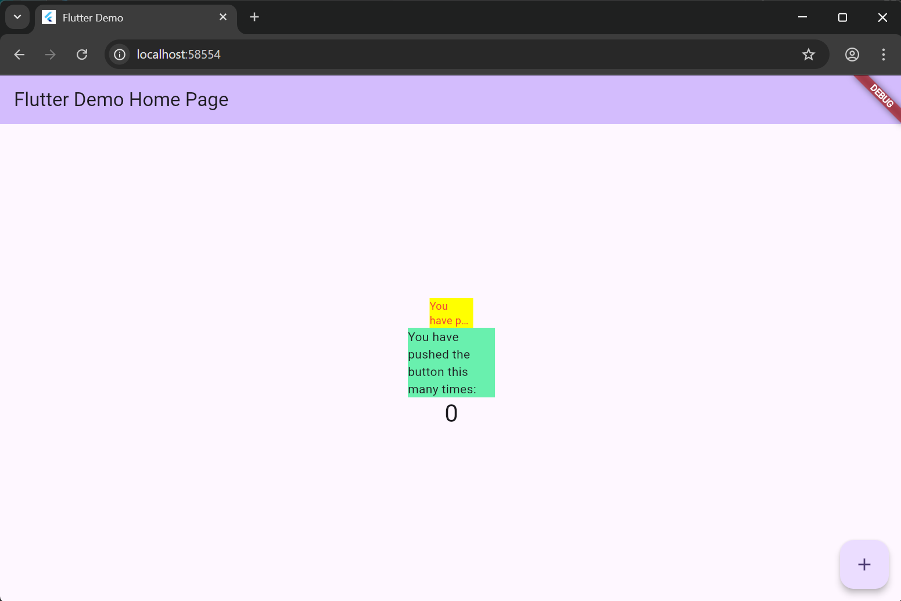

# flutter_plugin_pubdev

A new Flutter project.

## Getting Started

Jawaban Tugas Praktikum
1. Penjelasan Langkah 2 (Menambahkan Plugin)
melakukan instalasi library atau package pihak ketiga dari pub.dev (pusat package Flutter) ke dalam proyek lokal kita. secara otomatis akan:

Menambahkan dependensi auto_size_text ke dalam file pubspec.yaml.

Mengunduh source code plugin tersebut agar fungsi-fungsi AutoSizeText dapat digunakan di dalam kode Dart kita.

2. Penjelasan Langkah 5 (Variabel text dan Parameter Constructor)
membuat widget RedTextWidget menjadi dinamis dan reusable (dapat digunakan berulang kali).

Variabel text: Berfungsi sebagai wadah penyimpan data string yang akan ditampilkan.

Constructor (required this.text): Berfungsi sebagai "pintu masuk" data. Dengan kata kunci required, kita mewajibkan siapapun yang memanggil RedTextWidget untuk mengirimkan data teks, sehingga satu widget yang sama bisa menampilkan tulisan yang berbeda-beda tergantung input yang diberikan.

3. Fungsi dan Perbedaan Dua Widget pada Langkah 6
Widget RedTextWidget (Kotak Kuning):

Fungsi: Menggunakan plugin auto_size_text untuk menampilkan teks yang bersifat responsif.

Perilaku: Secara otomatis mengecilkan ukuran font agar teks tetap muat dan terbaca di dalam ruang yang sangat sempit (lebar 50), sesuai dengan batas maksimal baris yang ditentukan.

Widget Text Standar (Kotak Hijau):

Fungsi: Menampilkan teks statis dengan ukuran font tetap sesuai bawaan tema atau gaya yang diatur.

Perilaku: Karena ukuran font tidak bisa berubah secara otomatis, teks akan terpotong secara kasar (overflow) atau menghilang karena ruang kotak (lebar 100) tidak cukup untuk menampung seluruh kalimat.

4. Penjelasan Parameter pada Plugin auto_size_text
Berdasarkan dokumentasi resminya, berikut maksud dari tiap parameter yang digunakan:

text (Parameter pertama): Data string yang ingin ditampilkan di layar.

style: Digunakan untuk mengatur dekorasi teks, seperti warna (Colors.red) dan ukuran font dasar (fontSize: 14).

maxLines: Menentukan batas maksimal baris yang diizinkan. Jika diset 2, maka teks hanya akan memenuhi maksimal dua baris meskipun teks aslinya sangat panjang.

overflow: Menentukan apa yang terjadi jika teks tetap tidak muat setelah ukurannya sudah mengecil maksimal. TextOverflow.ellipsis akan memberikan efek titik tiga (...) di akhir teks yang terpotong.

5. Penjelasan Parameter Plugin auto_size_text
Berdasarkan dokumentasi resmi, berikut adalah fungsi dari masing-masing parameter yang digunakan untuk mengatur bagaimana teks menyesuaikan diri:

minFontSize:

Maksud: Membatasi ukuran font terkecil yang diizinkan saat proses pengecilan otomatis.

Fungsi: Menjaga agar teks tidak menjadi terlalu kecil hingga tidak bisa dibaca. Secara default, nilainya adalah 12.

maxFontSize:

Maksud: Membatasi ukuran font terbesar yang diizinkan.

Fungsi: Berguna jika kamu ingin membatasi ukuran teks meskipun ruang yang tersedia masih sangat luas (agar tidak terlihat terlalu raksasa).

stepGranularity:

Maksud: Menentukan tingkat presisi penurunan ukuran font (langkah penurunan).

Fungsi: Jika diset ke 1, font akan turun 1pt setiap kali mencoba menyesuaikan. Nilai yang lebih besar akan mempercepat performa karena langkah penurunannya lebih lebar.

presetFontSizes:

Maksud: Mendefinisikan daftar ukuran font spesifik yang diizinkan (misal: hanya boleh 40, 24, atau 12).

Fungsi: Jika parameter ini digunakan, maka minFontSize, maxFontSize, dan stepGranularity akan diabaikan.

group (AutoSizeGroup):

Maksud: Menghubungkan beberapa widget AutoSizeText agar memiliki ukuran yang seragam.

Fungsi: Sangat berguna jika kamu punya beberapa kotak teks berdampingan dan ingin semuanya memiliki ukuran font yang sama (sinkron).

overflowReplacement:

Maksud: Widget pengganti yang akan ditampilkan jika teks tetap tidak muat meskipun sudah dikecilkan semaksimal mungkin.

Fungsi: Bisa digunakan untuk menampilkan ikon atau pesan pendek seperti "Teks terlalu panjang" daripada menampilkan tulisan yang terpotong.

maxLines:

Maksud: Menentukan batas maksimal baris.

Fungsi: Menentukan area vertikal teks. Jika tidak diisi, AutoSizeText hanya akan menyesuaikan berdasarkan lebar saja.
